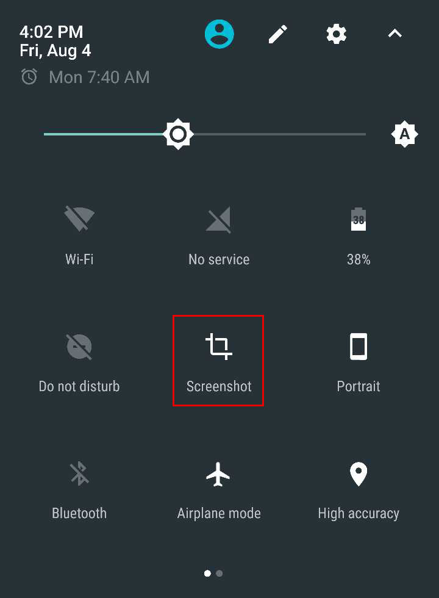
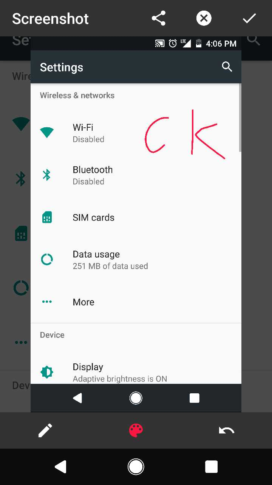

# Screenshot
这是一个运行在Android N 版本上的截图应用（基于成都西可内部项目[Screenshot](https://github.com/cktelecom/Screenshot)，我也有参与）。

## 使用
本应用只能运行在Android 7.0 及以上版本的系统上。

要使用本应用，首先要添加**截图**磁块到快速设置面板，之后就可以在任意时间快速截图了：

截图后的界面应该是这个样子：

## 扩展：
1. 分享
2. 涂鸦
3. 裁剪
4. 长截图(TBD)
